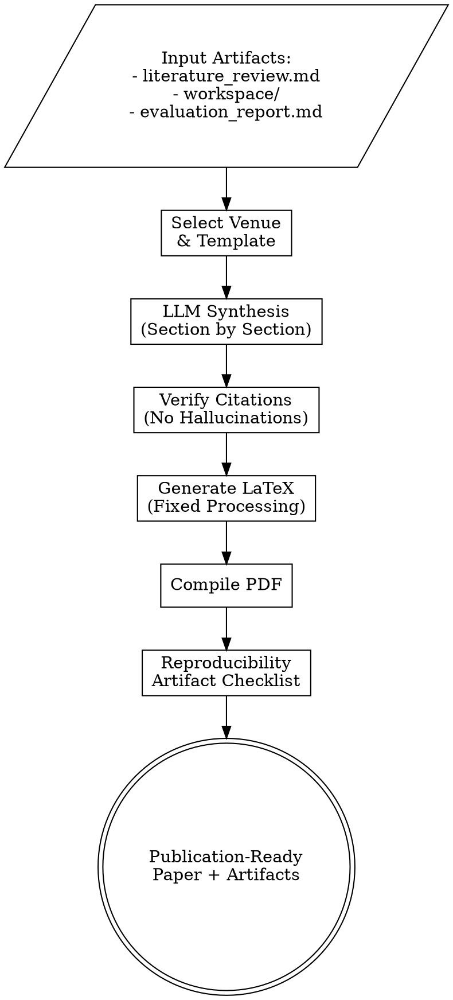

# CS Paper Writing for Top Venues

## Overview

Generate publication-ready CS papers for top-tier venues (NeurIPS, ICML, ICLR, ACL, AAAI, OSDI, CHI) by synthesizing content from research artifacts: literature surveys, implementations, and experimental evaluations.

**Core Principle**: Produce complete, technically accurate drafts that serve as strong starting points for human refinement.

**Critical Rule**: **NEVER hallucinate citations.** Every reference must be verified programmatically.

---

## Supported Venues

### Machine Learning
- **NeurIPS**: Neural Information Processing Systems (A*)
- **ICML**: International Conference on Machine Learning (A*)
- **ICLR**: International Conference on Learning Representations (A*)
- **AISTATS**: AI and Statistics (A)

### Natural Language Processing
- **ACL**: Association for Computational Linguistics (A*)
- **EMNLP**: Empirical Methods in NLP (A*)
- **NAACL**: North American Chapter of ACL (A)
- **COLM**: Conference on Language Modeling

### Computer Vision
- **CVPR**: Computer Vision and Pattern Recognition (A*)
- **ICCV**: International Conference on Computer Vision (A*)
- **ECCV**: European Conference on Computer Vision (A*)

### Systems
- **OSDI**: Operating Systems Design and Implementation (A*)
- **SOSP**: Symposium on Operating Systems Principles (A*)
- **NSDI**: Networked Systems Design (A*)
- **ATC**: USENIX Annual Technical Conference (A)

### Human-Computer Interaction
- **CHI**: Computer-Human Interaction (A*)
- **UIST**: User Interface Software and Technology (A*)

---

## Workflow



### Phase 1: Artifact Collection

**Read Input Files**:
```python
# Literature survey
literature = read_markdown("literature_review.md")
related_work = extract_related_work(literature)
citations = extract_citations(literature)

# Implementation
workspace = read_workspace("workspace/")
method_description = extract_method(workspace / "README.md")
code_url = get_repo_url(workspace)

# Evaluation
evaluation = read_markdown("evaluation_report.md")
results_tables = extract_tables(evaluation)
figures = list((evaluation.parent / "figures").glob("*.png"))
```

### Phase 2: Venue Selection & Template

**User Selects Venue**:
```bash
/paper-writing --venue neurips --from-artifacts ./
```

**Load Template**:
```python
template = load_template(venue="neurips")
# Returns: LaTeX template, page limits, formatting rules
```

**Venue-Specific Requirements**:
| Venue | Page Limit | Anonymity | Supplementary | Code Required |
|-------|------------|-----------|---------------|---------------|
| NeurIPS | 9 + refs | Yes (double-blind) | Unlimited | Encouraged |
| ICML | 8 + refs | Yes | Unlimited | Encouraged |
| ACL | 8 + refs | Yes | 8 pages | Yes (for reproducibility) |
| OSDI | 12 + refs | No | Unlimited | Required |

### Phase 3: LLM-Powered Synthesis

**Enhanced Prompt** (fixes Stage 3 issues):
```python
prompt = f"""You are an expert academic researcher writing a {venue} paper.

CRITICAL REQUIREMENTS:
1. **No Citation Hallucinations**: Only use citations from the provided list
2. **Technical Accuracy**: Match method descriptions to implementation
3. **Quantitative Results**: Include all experimental numbers
4. **Complexity Analysis**: Provide Big-O notation where relevant
5. **Code Availability**: Mention reproducibility artifacts

INPUT ARTIFACTS:
- Literature Survey: {related_work[:3000]}
- Method Implementation: {method_description}
- Experimental Results: {results_summary}
- Available Citations: {citation_keys}

PAPER STRUCTURE (for {venue}):

## Abstract (250 words)
- Problem statement (1-2 sentences)
- Proposed solution (2-3 sentences)
- Key results (2-3 sentences with numbers)

## Introduction
- Motivation: Why is this problem important?
- Limitations of existing work (from literature survey)
- Our contribution: What's novel?
- Paper organization

## Related Work
- Synthesize from literature_review.md
- Group by themes (not chronological)
- Clearly differentiate our work
- Use citations: \\cite{{key}}

## Method
- Algorithm description with pseudocode
- Complexity analysis (time/space)
- Implementation details (language, frameworks)
- Design choices and justifications

## Experiments
- Datasets and baselines (from evaluation_report.md)
- Experimental setup (seeds, hardware)
- Main results (tables with error bars)
- Ablation studies
- Statistical significance (p-values)

## Discussion
- Interpretation of results
- Limitations and failure cases
- Broader impact
- Future work

## Conclusion
- Summary of contributions
- Key takeaways

OUTPUT FORMAT:
Generate valid JSON with sections:
{{
  "title": "Concise Paper Title",
  "abstract": "...",
  "sections": [
    {{"name": "Introduction", "content": "..."}},
    ...
  ]
}}

IMPORTANT:
- Use \\cite{{refX}} for citations (keys: {citation_keys})
- Include \\begin{{algorithm}} blocks for pseudocode
- Reference figures: \\ref{{fig:results}}
- Reference tables: \\ref{{tab:comparison}}
- NO markdown formatting (use LaTeX commands)
"""
```

**LLM Call**:
```python
response = litellm.completion(
    model="anthropic/claude-sonnet-4",
    messages=[{"role": "user", "content": prompt}],
    response_format={"type": "json"}
)

paper_content = json.loads(response.choices[0].message.content)
```

### Phase 4: Citation Verification

**CRITICAL: Prevent Hallucinated Citations**

**Step 1: Extract Citation Keys**:
```python
cited_keys = re.findall(r'\\cite\{([^}]+)\}', paper_content)
# Returns: ['ref1', 'ref2', 'authors2024', ...]
```

**Step 2: Verify Each Citation**:
```python
for key in cited_keys:
    if key not in verified_citations:
        # Try to find citation
        paper = search_citation(key)
        if paper:
            verified_citations[key] = generate_bibtex(paper)
        else:
            # Mark as placeholder
            paper_content = paper_content.replace(
                f"\\cite{{{key}}}",
                f"\\cite{{PLACEHOLDER_{key}_VERIFY_THIS}}"
            )
            warnings.append(f"Citation {key} not verified")
```

**Step 3: Generate BibTeX**:
```python
bibtex_content = ""
for key, citation in verified_citations.items():
    bibtex_content += citation + "\n\n"

write_file("paper/references.bib", bibtex_content)
```

### Phase 5: LaTeX Generation (Fixed from Stage 3)

**Problem in Old Stage 3**: Markdown formatting leaked into LaTeX
```latex
% BAD (old Stage 3):
\\section{Introduction}
\\# Summary: Finding Rectangular Regions
\\#\\# Overview
```

**Solution**: Proper text processing pipeline

**Step 1: Protect LaTeX Commands**:
```python
def protect_latex(text):
    """Protect existing LaTeX commands from escaping."""
    protected = []
    def protect(match):
        idx = len(protected)
        protected.append(match.group(0))
        return f"__LATEX_{idx}__"

    # Protect: \\cite{}, \\ref{}, $...$, \\begin{}, \\end{}
    patterns = [
        r'\\cite\{[^}]+\}',
        r'\\ref\{[^}]+\}',
        r'\$[^$]+\$',
        r'\\begin\{[^}]+\}',
        r'\\end\{[^}]+\}'
    ]
    for pattern in patterns:
        text = re.sub(pattern, protect, text)

    return text, protected
```

**Step 2: Escape Special Characters**:
```python
def escape_latex_special(text):
    """Escape LaTeX special characters."""
    replacements = {
        '&': r'\&',
        '%': r'\%',
        '$': r'\$',
        '#': r'\#',
        '_': r'\_',
        '{': r'\{',
        '}': r'\}',
        '~': r'\textasciitilde{}',
        '^': r'\textasciicircum{}'
    }
    for char, escaped in replacements.items():
        text = text.replace(char, escaped)
    return text
```

**Step 3: Convert Markdown to LaTeX**:
```python
def markdown_to_latex(text):
    """Convert markdown formatting to LaTeX."""
    # **bold** -> \\textbf{bold}
    text = re.sub(r'\*\*(.+?)\*\*', r'\\textbf{\1}', text)

    # *italic* -> \\textit{italic}
    text = re.sub(r'\*(.+?)\*', r'\\textit{\1}', text)

    # `code` -> \\texttt{code}
    text = re.sub(r'`(.+?)`', r'\\texttt{\1}', text)

    # Lists
    text = convert_lists_to_latex(text)

    return text
```

**Step 4: Restore Protected Commands**:
```python
def restore_latex(text, protected):
    """Restore protected LaTeX commands."""
    for idx, cmd in enumerate(protected):
        text = text.replace(f"__LATEX_{idx}__", cmd)
    return text
```

**Complete Pipeline**:
```python
def prepare_text_for_latex(text):
    """Complete text processing pipeline."""
    text, protected = protect_latex(text)
    text = escape_latex_special(text)
    text = markdown_to_latex(text)
    text = restore_latex(text, protected)
    return text
```

### Phase 6: Template Population

**Generate main.tex**:
```latex
\\documentclass[{document_class_options}]{{article}}

% Venue-specific packages
{venue_packages}

\\title{{{title}}}

\\author{{
  {author_block}
}}

\\begin{{document}}

\\maketitle

\\begin{{abstract}}
{abstract}
\\end{{abstract}}

{sections}

\\bibliographystyle{{{bib_style}}}
\\bibliography{{references}}

\\end{{document}}
```

### Phase 7: PDF Compilation

**Compile with Tectonic** (handles dependencies automatically):
```bash
tectonic main.tex
# Runs: pdflatex → bibtex → pdflatex → pdflatex
```

**Fallback to pdflatex**:
```bash
pdflatex main.tex
bibtex main
pdflatex main.tex
pdflatex main.tex
```

### Phase 8: Reproducibility Artifact Checklist

**Generate artifact_checklist.md**:
```markdown
# Reproducibility Artifact Checklist

## Code Availability
- [x] Source code included
- [x] GitHub repository: {repo_url}
- [x] Dockerfile for environment
- [x] README with instructions

## Data
- [x] Dataset sources documented
- [x] Preprocessing scripts included
- [ ] Raw data (if public domain)

## Experiments
- [x] Random seeds specified
- [x] Hyperparameters documented
- [x] Training scripts included
- [x] Evaluation scripts included

## Results
- [x] Main results reproducible
- [x] Ablation studies reproducible
- [x] Statistical tests included

## Documentation
- [x] Installation guide
- [x] Usage examples
- [x] Expected runtime documented
- [x] Hardware requirements specified

## Venue-Specific
- [x] Anonymization (if double-blind)
- [x] Supplementary material prepared
- [x] Ethics statement (if applicable)
```

---

## Output Files

```
paper_[venue]_[timestamp]/
├── main.tex                      # LaTeX source
├── references.bib                # BibTeX citations
├── main.pdf                      # Compiled PDF
├── figures/                      # All figures (copied from evaluation)
│   ├── comparison.png
│   └── ablation.png
├── tables/                       # LaTeX tables
│   ├── results.tex
│   └── ablation.tex
├── supplementary/                # Additional materials
│   ├── supplement.pdf
│   └── code_submission.zip
├── artifact_checklist.md         # Reproducibility checklist
└── verification_warnings.txt     # Citation warnings, if any
```

---

## Advanced Features

### Citation Search Integration

**Semantic Scholar API**:
```python
def verify_citation_semantic_scholar(title, authors):
    """Verify paper exists using Semantic Scholar."""
    url = f"https://api.semanticscholar.org/graph/v1/paper/search"
    params = {"query": f"{title} {authors}"}
    response = requests.get(url, params=params)

    if response.json()["total"] > 0:
        paper = response.json()["data"][0]
        return generate_bibtex_from_api(paper)
    return None
```

**arXiv API**:
```python
import arxiv

def verify_citation_arxiv(arxiv_id):
    """Fetch paper metadata from arXiv."""
    search = arxiv.Search(id_list=[arxiv_id])
    paper = next(search.results())
    return generate_bibtex_from_arxiv(paper)
```

### Venue-Specific Formatting

**NeurIPS**:
- 9 pages + unlimited references
- Double-blind review (anonymize)
- neurips_2024.sty required

**ACL**:
- 8 pages + unlimited references
- Mandatory ethics statement
- Must include limitations section
- acl2024.sty required

**OSDI**:
- 12 pages + references
- Single-blind (authors visible)
- Mandatory artifact evaluation
- usenix2024.sty required

### Supplementary Material Generation

```bash
/paper-writing --venue neurips \
  --from-artifacts ./ \
  --generate-supplement

# Creates supplement.pdf with:
# - Additional experiments
# - Full algorithm pseudocode
# - Proof sketches
# - Extended related work
```

---

## Quality Standards

Every generated paper must:
- ✅ **100% verified citations** (zero hallucinations)
- ✅ **Compiles without errors** (LaTeX → PDF)
- ✅ **Quantitative results** (numbers from evaluation_report.md)
- ✅ **Complexity analysis** (Big-O notation)
- ✅ **Proper figures** (all referenced, high DPI)
- ✅ **Error bars** on experimental results
- ✅ **Reproducibility info** (code, data, hyperparameters)

---

## Common Pitfalls

### ❌ Avoid

**1. Hallucinated Citations**
```latex
% BAD: Made-up paper
\\cite{smith2024efficient}  % This paper doesn't exist!

% GOOD: Verified citation
\\cite{vaswani2017attention}  % Transformer paper, verified
```

**2. Markdown in LaTeX**
```latex
% BAD:
**Our method** achieves #1 results

% GOOD:
\\textbf{Our method} achieves \\#1 results
```

**3. Missing Error Bars**
```latex
% BAD:
Our method: 94.2\\%

% GOOD:
Our method: $94.2 \\pm 0.3\\%$
```

**4. No Statistical Tests**
```latex
% BAD:
"significantly better"

% GOOD:
"significantly better ($p < 0.001$, Cohen's $d=1.2$)"
```

---

## Examples

### Example 1: ML Paper
```bash
/paper-writing \
  --venue neurips \
  --from-artifacts ./ \
  --title "Efficient Attention Mechanisms for Long Sequences"

# Output: paper_neurips_20260201/main.pdf
```

### Example 2: Systems Paper
```bash
/paper-writing \
  --venue osdi \
  --from-artifacts ./ \
  --title "ScalableDB: A Distributed Key-Value Store"

# Output: Includes reproducibility artifacts for OSDI requirements
```

### Example 3: NLP Paper
```bash
/paper-writing \
  --venue acl \
  --from-artifacts ./ \
  --ethics-statement ethics.txt \
  --limitations limitations.txt

# Output: ACL format with required sections
```

---

## Integration with Pipeline

**Complete CS research workflow**:
```bash
# Step 1: Literature survey
/literature-survey "efficient attention mechanisms"

# Step 2: Implement method
/method-implementation --from-survey literature_review.md

# Step 3: Evaluate
/experimental-evaluation --workspace workspace/

# Step 4: Write paper (THIS SKILL)
/paper-writing \
  --venue neurips \
  --from-survey literature_review.md \
  --from-implementation workspace/ \
  --from-evaluation experiments/

# Output: Complete NeurIPS submission package
```

---

## References

- [NeurIPS Style Guide](https://neurips.cc/Conferences/2024/PaperInformation/StyleFiles)
- [ACL Author Guidelines](https://www.aclweb.org/portal/content/acl-author-guidelines)
- [OSDI Submission Guide](https://www.usenix.org/conference/osdi24/call-for-papers)
- [LaTeX Best Practices](https://www.overleaf.com/learn)
- [Citation Management](https://www.bibtex.org/)

---

**Skill Version**: 1.0.0
**Last Updated**: 2026-02-01
**Maintainer**: Claude Code Scientific Skills
